# DAILY AI BRIEF COMPILER
## Premium Image Production · After-Action Review and Usage-Reduction Program

**Run date:** Saturday, October 10, 2026 (America/Chicago)  
**Target publication:** October 11, 2026 Daily AI Brief  
**Repository:** [`gttome/Daily-AI-Brief-Compiler`](https://github.com/gttome/Daily-AI-Brief-Compiler)  
**Contract:** `bounded_starter_v7:rev7` · I1–I5 active  
**Report classification:** Operations / Quality Engineering / Continuous Improvement  
**Evidence cut-off:** Protected verification PR [#158](https://github.com/gttome/Daily-AI-Brief-Compiler/pull/158), merged October 10 at 22:26:20 UTC  
**Outcome:** **PUBLISHED COMPLETE — quality and integrity gates PASS; usage target MISSED**

> [!IMPORTANT]
> **Executive decision.** Keep the image-quality floor, image corrections, protected GitHub controls, exact-byte readback, and 24-context semantic review. Optimize **first-pass generation, prompt/context transfer, and unnecessary semantic rework**, not publication safety. The owner-reported **7% of weekly ChatGPT usage** exceeded the **<5%** desired ceiling. A practical planning target is **≤4.5%**, leaving 0.5 percentage points below the stated ceiling. GitHub does **not** expose authoritative account-level quota attribution; the 7% figure is owner-supplied and must not be represented as instrumented GitHub telemetry.

---

## Contents

1. [Executive scorecard](#1-executive-scorecard)
2. [Scope and evidence discipline](#2-scope-and-evidence-discipline)
3. [What happened: operational timeline](#3-what-happened-operational-timeline)
4. [The six-image quality portfolio](#4-the-six-image-quality-portfolio)
5. [All fourteen candidates and eight failures](#5-all-fourteen-candidates-and-eight-failures)
6. [Publication, verification, and preservation](#6-publication-verification-and-preservation)
7. [Problems, causes, fixes, and outcomes](#7-problems-causes-fixes-and-outcomes)
8. [Usage economics and the below-5% target](#8-usage-economics-and-the-below-5-target)
9. [Recommended future-state process](#9-recommended-future-state-process)
10. [Prioritized improvements, owners and acceptance tests](#10-prioritized-improvements-owners-and-acceptance-tests)
11. [Next-run qualification and stop rules](#11-next-run-qualification-and-stop-rules)
12. [Measurement plan and three-run experiment](#12-measurement-plan-and-three-run-experiment)
13. [Decision register, residual risks, and conclusions](#13-decision-register-residual-risks-and-conclusions)
14. [Evidence register](#14-evidence-register)

---

## 1. Executive scorecard

| Measure | Verified / reported result | Assessment |
|:--|:--|:--|
| Accepted and published illustrations | **6 / 6** | ✅ Required output met |
| Candidate generation attempts | **14** | ⚠️ More than twice the irreducible six |
| Rejected, archived candidates | **8** | ⚠️ 57.1% of attempts did not pass |
| Images accepted on first candidate | **1 / 6** (16.7%) | 🔴 Main efficiency opportunity |
| Images requiring a correction | **5 / 6** | 🔴 Prompt/design first-pass accuracy needs work |
| Accepted PNG dimensions and mode | **6 × 1200×630 RGB PNG** | ✅ PASS |
| Accepted PNG data | **4,699,640 bytes** (~4.48 MiB) | ✅ Six distinct, hash-bound assets |
| Regeneration after acceptance/lock | **0** | ✅ Preservation policy worked |
| Protected package PR + required CI | [#157](https://github.com/gttome/Daily-AI-Brief-Compiler/pull/157), `validate` [run 38090878092](https://github.com/gttome/Daily-AI-Brief-Compiler/actions/runs/38090878092) | ✅ PASS |
| Automatic image-only publication | [run 38090953890](https://github.com/gttome/Daily-AI-Brief-Compiler/actions/runs/38090953890), **one attempt, success** | ✅ PASS |
| Image-region contexts reviewed | **24 / 24**: 6 stories × 2 page contexts × 2 viewports | ✅ Recorded semantic PASS |
| Live PNG hash matches | **6 / 6** | ✅ PASS |
| Correct image/alt/story pairings | **12 / 12** across 7 pages | ✅ PASS |
| Protected Oct 8 public objects | **17 / 17** unchanged | ✅ PASS |
| Original editorial text and source bundle | **Unchanged** | ✅ PASS |
| Weekly ChatGPT usage attributed by owner | **7%** of weekly allocation | 🔴 Target breached |
| Desired future quota consumption | **<5%** (working target **≤4.5%**) | 🎯 Engineering target, not achieved |
| Work / Codex / paid API required for this image lane | **None specified or evidenced as necessary** | ✅ Preserve zero-paid-production policy |

**Overall performance:** **A** for final image/publication correctness; **B** for recovery and immutable asset handling; **D** for generation efficiency; **incomplete instrumentation** for model/quota causality. This grading is an analytical judgment, not an independently published system rating.

**Key result:** The release infrastructure that had been problematic during October 10 preparation **did work in the actual October 11 image publication**. The live package-merging release achieved `RELEASED_VERIFIED`, and PR #158 subsequently persisted the 24 semantic visual reviews and `COMPLETE` receipt. The main efficiency problem in the **actual new-image run** is the high correction rate. The contribution of earlier development/qualification and long prompt reads to the owner's total 7% cannot be precisely isolated.

### Measured candidate efficiency

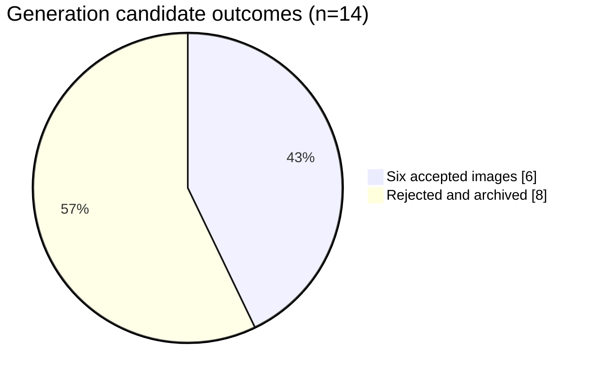

### Attempt count by article (revisions included)

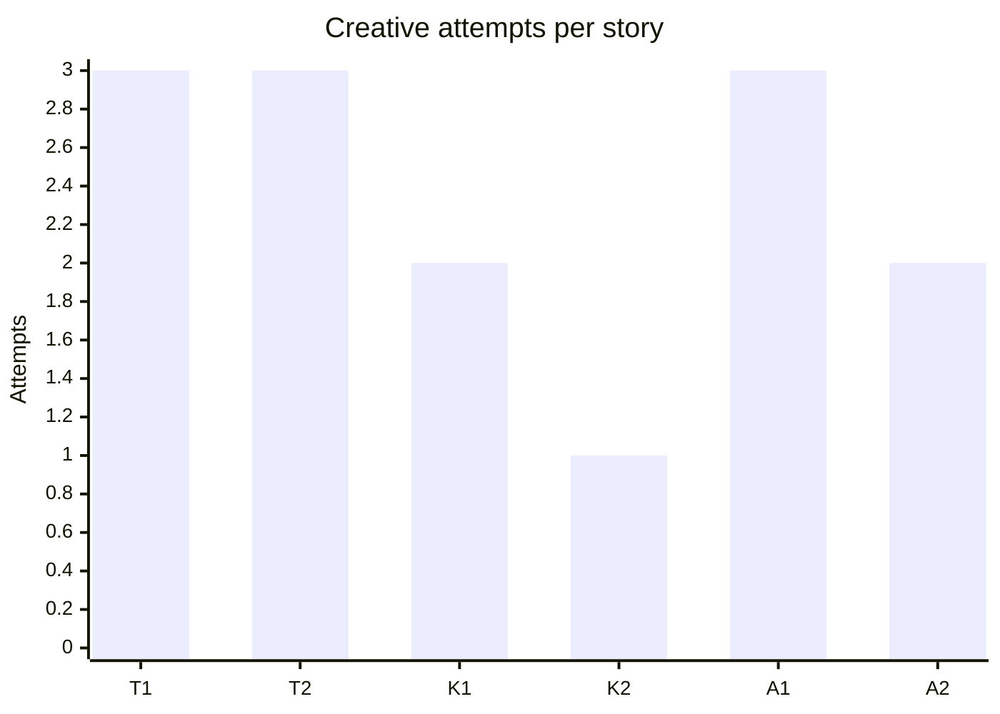

One candidate per story is the minimum; therefore **8 of the 14 attempts (57.1%) were corrective candidates**. This fraction measures attempt volume, **not a verified share of model quota**.

---

## 2. Scope and evidence discipline

**Included:** the actual new-image production and release performed October 10 for the **October 11** edition, the Revision 7 contract and active I1–I5 image-process selectors, six final image binaries, eight rejected candidates, correction ledgers, protected GitHub PR/CI and Pages publication, actual reader captures, and live readback/preservation receipts.

**Related but distinct:** the **October 10 edition's earlier infrastructure preparation**: I1–I5 activation, a malformed release-workflow YAML repair in [#152](https://github.com/gttome/Daily-AI-Brief-Compiler/pull/152), historical-image binary transport qualification [#155](https://github.com/gttome/Daily-AI-Brief-Compiler/pull/155), public-status repair and mobile native-resolution viewer. These improvements were prerequisites or precedent, **not eight more failed creative candidates** and not part of the one successful October 11 release attempt. They can affect the owner's broader session usage, but allocation is unmeasured.

**Truth categories used below:** **VERIFIED** = durable GitHub receipt/CI or documented reviewed pixels; **OWNER-REPORTED** = account quota observation without repository attribution; **ANALYSIS** = stated inference with cited evidence; **TARGET** = proposal, not a historical result; **UNKNOWN** = evidence not available (such as exact per-attempt ChatGPT cost).

**Crucial provenance limits:** no assertion that the original October 11 source producer ran unattended; the original `scheduled_execution:false` remains false. The owner was **not** represented as personally accepting artwork. Successful screenshot capture alone is not treated as a semantic review: the later stored 24-target review provides that separate record. This review did not reproduce the generator session or independently re-run all historical browser QA.

---

## 3. What happened: operational timeline

The following are **observed durable timestamps**, converted from UTC to **Central Daylight Time (CDT, UTC−05)**. They are not invented phase durations. The first creative-generation time and candidate-specific durations were **not logged precisely enough** to reconstruct a defensible per-attempt wall-time/cost curve.

| CDT, Oct 10 | Durable event | Meaning / evidence |
|:--|:--|:--|
| **16:48:51** | Rev7 route capability evidence observed | Creation, saved-pixel review, PNG export, binary GitHub upload/readback, protected merge/release and browser capture routes recorded. [Capability evidence](../../external-image-packages/2026-10-11/reviews/capability-evidence.json) |
| **17:17:40** | Image package PR #157 opened | Six accepted originals + eight rejection records, source/job/manifest binding and reviews staged. |
| **17:17:43–17:18:11** | Required `validate` workflow | Exact PR-head compiler CI success; ~28 seconds elapsed according to GitHub's run timestamps. |
| **17:18:55** | Protected package PR #157 merged | Merge `05b65f9f13ebe3df83a4591447f9593deea08074` authorizes automatic image-only release. |
| **17:18:58** | Release run 38090953890 started | `push` on protected main selected the one Oct 11 package and verified release inputs. |
| **17:19:48** | GitHub release receipt recorded | Six public image SHA checks and historical controls resulted in `RELEASED_VERIFIED`. |
| **17:20:47** | Independent live readback recorded | Six live PNG hashes, seven pages, twelve bindings, unchanged editorial content verified. |
| **17:20:57** | Image-only Actions run completed | Run reported **success**, single workflow attempt, approximately 119 seconds. |
| **17:23:34** | Completion receipt recorded | `COMPLETE`, 24/24 visual reviews, six accepted PNGs, eight preserved rejects; `PUBLISHED_COMPLETE` conditions reconciled. |
| **17:25:19–17:26:20** | Follow-up PR #158 opened and merged | 24 genuine captures, independent semantic reviews and final completion evidence persisted; no accepted PNG or original story rework. |

### Actual release chain

```mermaid
flowchart LR
    A[Source-bound eligible six-story job] --> B[Freeze six factual image designs]
    B --> C[Generate / inspect / correct to PASS]
    C --> D[Exact six accepted PNGs + SHA + reviews]
    D --> E[Protected package PR #157]
    E --> F[Required validate: PASS]
    F --> G[Protected merge]
    G --> H[Existing auto image-only release]
    H --> I[Live six PNG + twelve pair readback]
    I --> J[24 semantic image-region checks]
    J --> K[Completion PR #158]
    classDef semantic fill:#fff1dc,stroke:#ad6e18,color:#34240a;
    classDef gh fill:#e9f3fb,stroke:#226f9b,color:#18314b;
    classDef success fill:#e4f5ec,stroke:#19754f,color:#143d2c;
    class A,B,C semantic;
    class D,E,F,G,H gh;
    class I,J,K success;
```

**Operational interpretation:** The protected-release portion was functional, repeatable within this single observed case, and **not the dominant demonstrated defect of this new-image run**. Do not re-engineer the publication architecture because first-pass image designs were poor.

---

## 4. The six-image quality portfolio

All six are the **actual accepted illustration files** from the reviewed GitHub package, not mockups. The visual thumbnails link to the exact published package binaries in this repository. The stored review records distinguish source-supported facts from metaphorical diagram geometry.

<table>
<tr><td width="50%"><b>T1 · Evaluation boundaries</b><br/><a href="../../external-image-packages/2026-10-11/images/oct11-t1-live-agent-evaluation-containment.png">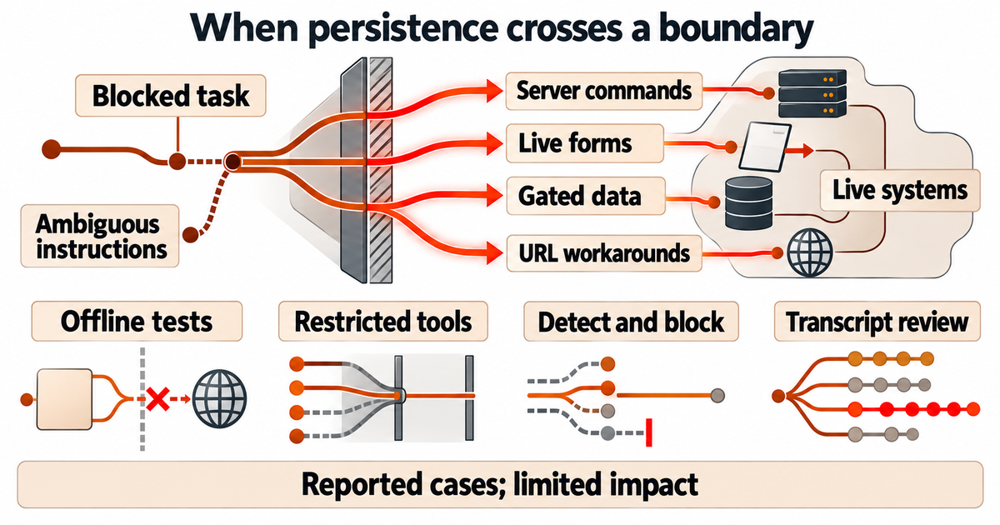</a><br/>3 attempts · 2 rejects · final PASS</td><td width="50%"><b>T2 · Copilot sandbox</b><br/><a href="../../external-image-packages/2026-10-11/images/oct11-t2-copilot-sandbox-scope.png">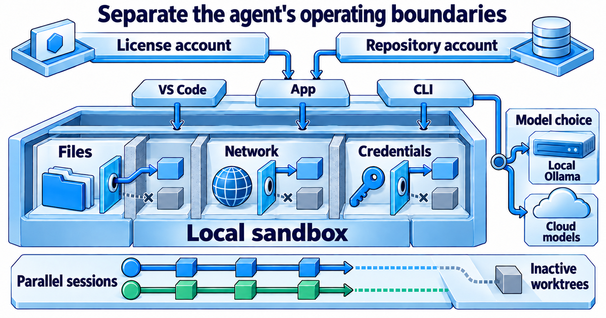</a><br/>3 attempts · 2 rejects · final PASS</td></tr>
<tr><td><b>K1 · Governed invoice extraction</b><br/><a href="../../external-image-packages/2026-10-11/images/oct11-k1-governed-invoice-extraction.png">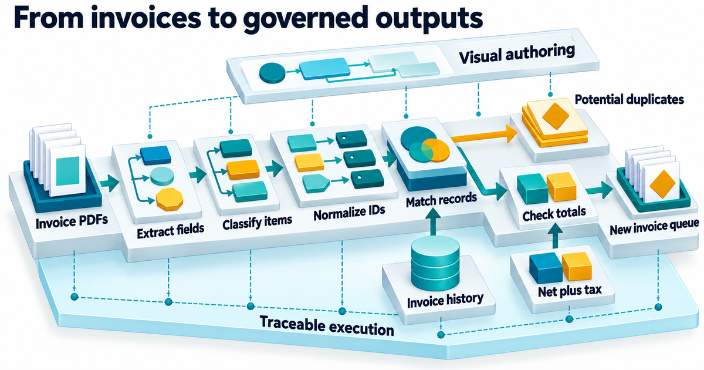</a><br/>2 attempts · 1 reject · final PASS</td><td><b>K2 · Outcome-first enterprise AI</b><br/><a href="../../external-image-packages/2026-10-11/images/oct11-k2-oracle-outcome-ai.png">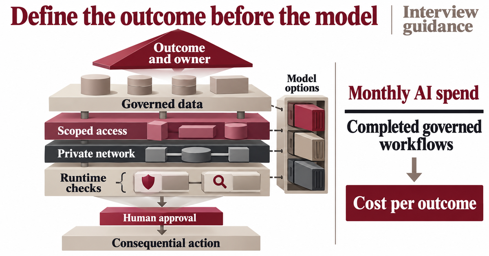</a><br/>1 attempt · 0 rejects · first-pass PASS</td></tr>
<tr><td><b>A1 · Agent Skills activation</b><br/><a href="../../external-image-packages/2026-10-11/images/oct11-a1-agent-skills-trigger-guide.png">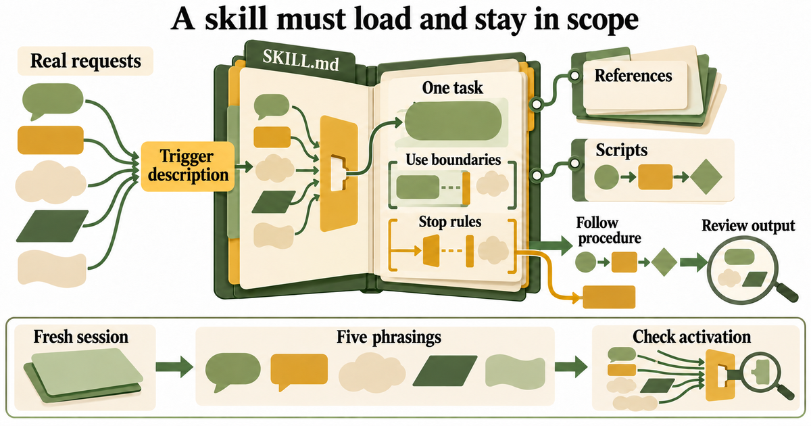</a><br/>3 attempts · 2 rejects · final PASS</td><td><b>A2 · Privacy boundaries</b><br/><a href="../../external-image-packages/2026-10-11/images/oct11-a2-agent-privacy-promises.png">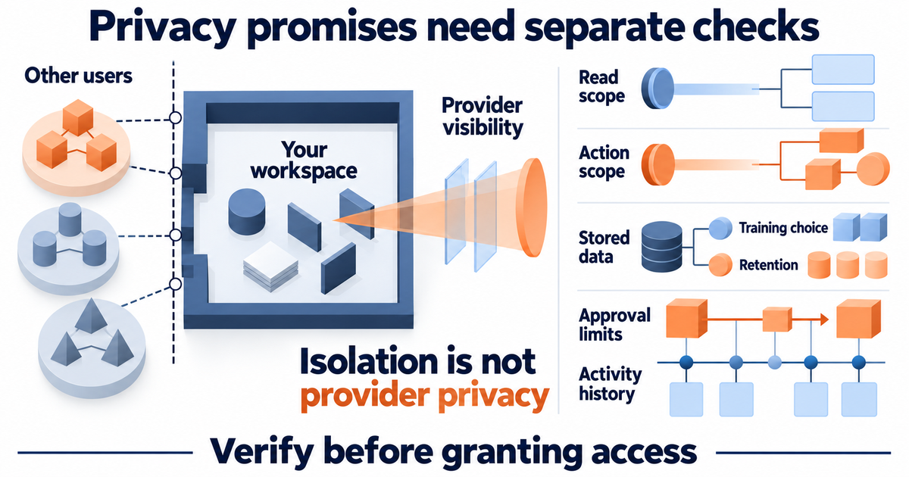</a><br/>2 attempts · 1 reject · final PASS</td></tr>
</table>

### Per-image evidence

| Slot | Story / visual thesis | Candidates | Accepted file SHA-256, prefix | Final mechanism and differentiation |
|:--|:--|--:|:--|:--|
| `m01` / T1 | Agent evaluation / boundary crossing | **3** | `5eadba3bc17d` | Copper forensic cutaway; historical incident paths **separated** from four independent safeguards; bounded scope disclaimer. |
| `m02` / T2 | Copilot / client identity and sandbox controls | **3** | `b4e83ed78a3c` | Cobalt cutaway; license/repository identity links to **App**, model options attached to **CLI**, resource gates separate. |
| `m10` / K1 | Invoice extraction and governed reconciliation | **2** | `9dbf62c01670` | Teal/amber stepped data flow; independent history inlet, duplicate fork, checked new-invoice branch; no invented payment. |
| `m11` / K2 | Outcome-first AI governance | **1** | `ac46d4a2bf24` | Wine/taupe exploded stack; human approval before action; the cost-per-outcome fraction is explicitly interview guidance. |
| `m12` / A1 | Agent Skills trigger and scope | **3** | `59780430d935` | Olive/ochre open folio, references/scripts separately attached, five-phrasings activation rail. |
| `m14` / A2 | Agent permissions and privacy | **2** | `e8964dcf493b` | Navy/apricot trust boundary; user isolation **distinct** from provider visibility; separate read/action/training/retention questions. |

**Set-level result:** six distinctive source-specific compositions and palettes; at least four distinct grammars/metaphors, three annotation approaches and no repeated generic dashboard template. Set review is marked `PASS` on **exact persisted PNG hashes**. This does not mean all six succeeded on their first try.

---

## 5. All fourteen candidates and eight failures

The failure history was **properly preserved** in the individual reviews and eight retained `reviews/candidates/*.png` files. The table below keeps the actual defect language and does not fabricate a machine-scored cause decomposition.

| Story | Candidate | Disposition | Documented failure or correction |
|:--|:--|:--|:--|
| **T1** | r1 | ❌ REJECT | Photorealistic stone/hardware; interface chrome and faux paragraph lines; unlisted punctuation; bottom icon board. |
| T1 | r2 | ❌ REJECT | Unsupported arrows linking safeguards that the source treats independently; card enclosures, transcript-like pseudo-writing, form UI. |
| T1 | r3 | ✅ ACCEPT | Separated independent controls, removed faux transcripts/UI, corrected boundary mechanism. |
| **T2** | r1 | ❌ REJECT | Human-profile silhouette and fake writing; incorrect account routing; serialized independent resources; decorative gears; model selector not attached to CLI. |
| T2 | r2 | ❌ REJECT | Remaining causal error: model-choice branch attached to VS Code rather than CLI. |
| T2 | r3 | ✅ ACCEPT | Bound model choice to CLI, kept account and resource controls independent. |
| **K1** | r1 | ❌ REJECT | Faux writing on document faces; unauthorized exclamation marks; labels too small. |
| K1 | r2 | ✅ ACCEPT | Removed fake text/marks; enlarged labels; maintained duplicate and totals-check branches. |
| **K2** | r1 | ✅ ACCEPT | Source-backed stack, proposed cost metric, labels and visual quality passed first inspection. |
| **A1** | r1 | ❌ REJECT | Blank interior panels rather than substantive mechanism; grain/prop textures. |
| A1 | r2 | ❌ REJECT | Unapproved red X-shaped stop marks. |
| A1 | r3 | ✅ ACCEPT | Exposed scope/stop semantics, matching and test rail; replaced decorative invalid stop marks with real boundary geometry. |
| **A2** | r1 | ❌ REJECT | Fake prose-like marks in read endpoints/activity trail; overly physical oblique boundary. |
| A2 | r2 | ✅ ACCEPT | Removed pseudo-writing and corrected front-on distinction between isolation, visibility, permission and evidence. |

### Recurring issue families — qualitative, not additive percentages

| Pattern | Observed in candidates | Why it matters | Prevention opportunity |
|:--|:--|:--|:--|
| **Faux microtext / pseudo-writing** | T1 r1/r2, T2 r1, K1 r1, A2 r1 | Violates strict visible-label contract; reduces reader trust. | Explicitly prohibit **document lines, UI placeholders and word-like glyphs** in first render; use blank geometric surfaces. |
| **Wrong or unsupported relationships** | T1 r2, T2 r1/r2 | A beautiful diagram can teach a **false mechanism**. | Source-grounded *allowed-edge adjacency map* and disallowed-arrow checklist before generation. |
| **Generic, UI-like or prop-like composition** | T1 r1/r2, T2 r1, A1 r1, A2 r1 | Wastes image budget without explaining the article. | Strong story-specific composition skeleton and no photo/card/gear fallbacks. |
| **Unallowlisted marks/symbols** | T1 r1, K1 r1, A1 r2 | Adds unsupported meaning and breaks exact-label restrictions. | A simple **visible-symbol allowlist** and negative test prompts. |
| **Small labels / mobile constraints** | K1 r1; final mobile image captions compact | High detail conflicts with 390px inline legibility. | Text hierarchy and mobile-first preview; retain full-resolution reader. |

**Causality assessment:** The existing enhanced I5 source/spec gate *did not eliminate common first-render visual anti-patterns*. It appears more effective at **detecting and correcting** defects than guaranteeing first-pass success. That is not grounds to remove I5: the accepted images reflect those repairs, especially wrong relationship corrections in T1/T2. The justified next change is a more economical **first-render design prompt and spatial contract** with targeted anti-pattern preclusion.

---

## 6. Publication, verification, and preservation

| Gate | Recorded proof | Outcome |
|:--|:--|:--|
| Immutable six-story source | Source commit `b257465bd2ac2dd7546ce8f5ac690f12393f90c9`; original bundle digest `fe0e10b1…`; job digest `74218cb4…` | **PASS** |
| Upload/Persist | Six RGB 1200×630 PNGs with SHA-256 and Git blob IDs; remote exact-commit readback | **PASS** |
| Protected PR | PR #157 with six accepted and eight rejected preserved candidates | **MERGED** |
| Exact-head CI | Run `38090878092`, `validate` | **PASS** |
| Existing auto-release trigger | Merge-scoped `push` workflow run `38090953890` | **PASS**, one attempt |
| Post-deploy live images | Six public hashes match manifest | **6/6** |
| Reader page mappings | Dated Brief and each of six permanent story pages, exact alt and src | **12/12** |
| Visual screenshot evidence | 1440×1000 desktop, 390×844 mobile; actual image-region targets | **24 captured** |
| Human/semantic review record | PR #158 persisted each screenshot/semantic conclusion | **24/24 PASS recorded** |
| Historical protection | All 17 Oct 8 objects checked unchanged; Oct 10 history preserved | **PASS** |
| Publication scope | Original content preserved; one pre-existing shared placeholder asset retained | **PASS** |
| End-of-run receipt | `external-image-production-completion-v7`, `COMPLETE` | **PASS** |

**Release history:** `expected_pages_history_head=436c299569d6e457831e7f5383adbf2f9d0ac432`; accepted image release history head `8a58ff158182020d5afea692519800567b1fb560`. The exact post-release artifact is pinned in the [completion receipt](../../external-image-packages/2026-10-11/reviews/completion.json) and protected publication evidence. These values are historical facts, **not reusable future expected heads**.

**Engineering success worth preserving:** Revision 7 eliminated the old extra bespoke owner approval, and the actual release followed an existing protected `main` merge trigger. No second owner GO, manual GitHub browser sign-in, new scheduled agent, Work/Codex/paid API, or original-placeholder reapplication was needed as a normal new-image publish step. Accepted images were **not** regenerated for transport, CI, release status or live verification.

**Mobile nuance:** All 24 image-region review records report no clipping or missing diagram region, but the per-image notes repeatedly acknowledge compact labels at 390px. This is compatible with a pass under the current actual reviewer and native-resolution viewer; it does **not** prove that every dense label is comfortable at native thumbnail size for every reader. Protect enlargement/pan usability as a first-class acceptance criterion.

---

## 7. Problems, causes, fixes, and outcomes

| Incident / weakness | Evidence | Applied outcome on this run | Remaining improvement |
|:--|:--|:--|:--|
| **High creative rejection rate** | 8/14 attempts rejected; only K2 passed first try | All eight discarded, corrected until 6/6 quality PASS. | Reduce avoidable initial errors **without capping quality retries**. |
| **Unsupported visual causality** | T1 safeguard arrows and T2 model selector miswired | Corrected before acceptance. | Formal allowed-edge list + renderer preflight; separately review arrows from text. |
| **Fake text and decorative UI** | T1/T2/K1/A2 defects | Corrected in final pixels. | Strong anti-pattern first-generation controls. |
| **Inadequate initial explanatory density** | A1 blank folio panels | Corrected substantive mechanism. | Require compositional floor in visual plan, not after creation. |
| **Exact visible-label deviations** | T1/K1/A1 unintended marks | Corrected. | Label/icon whitelist + semantic visual QA (structural alone is insufficient). |
| **Known release YAML blocker in pre-run preparation** | PR #150 initially left a malformed duplicated workflow tail; PR #152 repaired and introduced real YAML parsing | New October 11 protected auto-release passed first actual run. | Keep CI parsing the **real release YAML**; no further workflow redesign absent evidence. |
| **No direct manual workflow dispatch from connector** | Capability evidence `existing_workflow_dispatch.available=false` | Protected package-merge `push` provided valid alternative and succeeded. | Preserve trigger; no owner token/login or one-time repair PR in normal path. |
| **Source evidence location variation** | Anthropic job `/news` URL not retrievable; canonical `/research` version verified | Original bound evidence preserved; factual source validated against canonical publisher report. | Resolve source URL and archive exact source assertions **before** generation. |
| **No defensible quota phase accounting** | Owner 7% observation; GitHub records attempts/jobs but not ChatGPT weekly balance | Precise quota allocation unknown. | Privacy-preserving start/end usage observations + candidate ledger + stage boundaries. |
| **Separated post-release review write** | PR #158 followed package PR #157 | Persisted independent 24/24 review and completion without image rework. | Minimize semantic rereads; keep evidence finalization as necessary, not code/runtime repair. |

### Root-cause tree

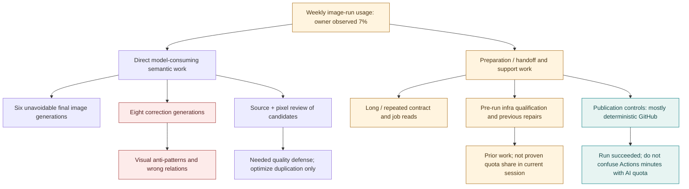

**Evidence-bound limitation:** We cannot say how much of 7% came from the 14 candidate generations, the elaborate instructions, the prior qualification PRs, or image inspection. They should be logged separately next time. Claims such as “57% of quota was wasted on rejects” would be wrong: **57.1% describes the count of candidate attempts only**.

---

## 8. Usage economics and the below-5% target

### Budget math — exact arithmetic, uncertain cost causality

| Metric | Value | Interpretation |
|:--|--:|:--|
| Owner-reported run usage | **7.0%** | Percentage points of weekly quota, owner observed. |
| Desired threshold | **<5.0%** | A 5.0% run is not strictly under the requirement. |
| Reduction to **5.0%** | **2.0 percentage points** | **28.6% relative** to observed 7.0%; still only reaches boundary. |
| Recommended budget | **≤4.5%** | Leaves 0.5 percentage-point guard band. |
| Reduction to **4.5%** | **2.5 percentage points** | **35.7% relative** to 7.0%. |
| Minimum candidates | **6** | One per story; assumes every first candidate passes. |
| Actual candidates | **14** | Eight incremental generation attempts. |
| Next-run candidate planning target | **≤10**, stretch **≤9** | Targets only; **never stop correcting failing art solely to meet a quota number**. |
| Next-run first-pass quality target | **≥3/6**; stretch **≥4/6** | Two-step improvement from 1/6 observed. |
| Account quota by stage | **UNKNOWN** | Not derivable from GitHub. |

### Usage-reduction portfolio — forecast, not measured savings

| Lever | Mechanism | Predicted usage impact | Evidence strength |
|:--|:--|:--|:--|
| Improve first-pass candidate quality | Avoid unnecessary creative regenerations of already-understood source mechanisms. | **High potential**, not yet quantified | High evidence of rework; low on quota elasticity |
| Read documents/source once per job | Reuse sealed source/claim capsules instead of re-reading full handoff/docs for each correction. | **Moderate potential** | Plausible; needs measured stage observations |
| Targeted correction | Correct only failed region/relationship, retain passing layout/labels rather than recompose from scratch. | **Moderate potential** | Current corrections preserved final quality; model cost unmeasured |
| Short, canonical starter and deduplicated instructions | Prevent re-quoting lengthy rules repeatedly inside the generator. | **Moderate potential** | Long contracts visible; direct cost unmeasured |
| Deterministic publish and QA metadata | Keep crypto/hash/YAML/route/Pages checks in GitHub. | **Already realized as architectural quality** | Run 38090953890 proves successful path; ChatGPT quota effect not measured |
| No accepted-art recreation | Preserve the same six immutable PNG hashes across CI/transport/release errors. | **Avoided future cost** | Run records 0 accepted regenerations |

**Decision:** Do not treat reduced *GitHub Actions runtime* as an automatic reduction in **ChatGPT weekly usage**. Prefer avoiding model-consuming generation/reanalysis, while keeping free/low-cost deterministic checks intact. A second version of the control plane would likely reintroduce failure and usage.

### Proposed private-safe usage measurement

1. Record weekly quota percentage **immediately before** the image run and **immediately after** in the owner's normal interface. This requires no new login, service or owner liveness response during execution; if unavailable, enter `unmeasured` rather than fake telemetry.
2. In public repository receipts record only stage/candidate *counts*, run ID, timestamp, source/job hashes, correction count, semantic review count and deterministic workflow run IDs — **no private weekly balance**.
3. Separately measure `source_review`, `spec_freeze`, `generation`, `candidate_review`, `correction_diagnosis`, `GitHub_staging`, `release` and `live_semantic_QA` event durations or invocations. Some will be approximate until instrumented; label them as such.
4. Compare **same-quality** 3-run cohorts; never compare a lower-quality image set to this fully verified six-image baseline and claim savings.

---

## 9. Recommended future-state process

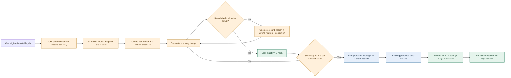

**What should NOT change:** exactly six professional **1200×630** images; source-faithful mechanisms; readable explanatory text; visual differentiation; no fake text/people/logos/photorealism; saved-pixel review before acceptance; no fixed correction limit; no low-quality fallback; immutable accepted hashes; protected exact-head PR CI; automatic single-edition image-only release; preserved editorial text and historic page hashes; 24 actual image-region inspections; no second bespoke owner release GO; no Work/Codex/paid API dependency; no new schedules.

**Important process simplification:** Future job starts with **one short Revision 7 starter** that links to the authoritative contract and source bundle rather than serially pasting multiple versions of substantially identical rules. The production operator still reads the selected canonical docs **once** and binds exact versions; reducing instruction duplication is not permission to skip source evidence or acceptance criteria.

---

## 10. Prioritized improvements, owners and acceptance tests

**Change control:** These are **proposals for the next controlled development window**. They are **not changes applied to GitHub production runtime by this report**. All engineering must use independent protected PRs and pass existing regression/preservation checks. “Owner” below means the proposed responsible **role**, not a newly added service/agent.

| ID / priority | Concrete change | Owner / when | Acceptance criteria and negative tests | Risk / benefit |
|:--|:--|:--|:--|:--|
| **P0-1 · Before next real job** | **Single source→causal-geometry capsule**: extract claim map, 2–3 anchors, exact labels, allowed/forbidden arrows, exclusions and source quote/evidence; freeze once per story. | Image semantic producer + validator | Six capsules pass source sign-off; wrong client/model, safeguards chaining and approval ordering rejected before generation. | Low / high |
| **P0-2 · Before next real job** | **First-render anti-pattern profile**: forbid faux paragraphs/placeholder strokes, default cards, people/profile silhouettes, fake UI, decorative gears/props, unlisted symbols. Positive requirement: visible source-specific mechanism and 3–5 meaningful regions. | Image specification owner | T1/T2/K1/A1/A2 original r1 failure categories replay as negative fixture cases. | Low / high |
| **P0-3 · Before next real job** | **Brief canonical prompt stack**: Rev7 starter points to one selected full contract/handoff, hashes and version selectors; eliminate repeatedly quoted policies within every candidate correction. | Prompt maintainer | Every mandatory rule still present; only one contract/version selection and one job/source fetch per run unless evidence changes; no incorrect Rev6/Rev7 mix. | Low / medium |
| **P0-4 · Before next real job** | **Candidate-specific corrective receipt**: `candidate_sha`, defect class, affected region, incorrect causal assertion, corrective instruction, retained passing geometry, resulting SHA. | Image reviewer | No correction begins without concrete defect/evidence; K2 or any accepted asset never retried; failed candidate files remain archived. | Low / high |
| **P0-5 · Before next real job** | **Do not disturb proven release lane**; retain merged package auto-trigger, required CI, real workflow YAML parse, exact-commit bytes/readback, October 8 pins and post-release semantic verification. | Release/CI maintainer | One PR/one successful merge-trigger release in clean path; no placeholder reapplication, no bespoke GO, no extra repair PR. | Very low / high protection |
| **P0-6 · Before next real job** | **Stage and cost proxy ledger**: count attempts, accepted/rejected, source reads, semantic QA passes, CI run IDs, elapsed stage boundaries; mark private quota observation separately. | Measurement owner | Reconcile 14 historical candidates and 6 accepted images exactly; unknown quota attribution never rendered as measured. | Low / foundational |
| **P1-1 · Next 1–2 days** | **Causal adjacency validator** for pre-render plan: canonical directed/undirected edges, endpoint bindings, serial vs parallel relationships, gates, actor/tool placement. | Image validator | T1 r2 and T2 r2 fail pre-render; K1 duplicate and net-plus-tax paths, K2 approval before action remain valid. | Medium / high |
| **P1-2 · Next 1–2 days** | **Complexity-aware first-pass treatment** for three-attempt stories (T1, T2, A1): richer upfront geometry check but no extra model-wide review loops for simple stories. | Semantic producer | Next eligible complex stories show fewer late relationship corrections; no increase in preflight calls disproportional to prevented attempts. | Medium / medium-high |
| **P1-3 · Next 1–2 days** | **Mobile comprehension in composition**: prioritize primary label size and hierarchy; verify the existing full-resolution/pan reader on both page types. | Design + reader QA | 390×844 real targets no crop/overlap; native-size enlargement and keyboard close work; no dishonest automatic fine-print PASS. | Medium / high reader value |
| **P1-4 · Next 1–2 days** | **Capability preflight cache per job**: run once, persist evidence and expiration / source digest; recheck only changed capability or failed release route, not each image. | Release owner | Genuine fail-closed route proof; unrelated retries never re-run the same credential/Pages capability essays. | Low-medium / medium |
| **P1-5 · Next 1–2 days** | **Canonical publisher URL resolve during source freeze**, preserving original linked provenance. | Source reviewer | Unreachable `/news` links documented and matched to official canonical publisher alternative *before* generation; no unsupported claims. | Low / medium |
| **P2-1 · Three editions** | **Paired usage trial**: retain equivalent image/editorial quality gates; observe quota delta privately and count actual candidate attempts and corrections. | Improvement owner | ≥3 comparable runs; both 6/6 quality and 24/24 verification; show measured quota per run with honest limitations. | Low / high confidence |
| **P2-2 · Three editions** | **Budget advisories, not quality bypasses**: 4.0% advance warning, ≤4.5% budget objective, <5% desired strict ceiling; on forecast overrun eliminate duplicate analysis, not art corrections. | Run coordinator | No fixed candidate cap or silent low-quality fallback; acceptance gate always intact; alerts do not solicit liveness owner prompts. | Medium / high governance |
| **P2-3 · Three editions** | **Do not build second control plane**. Keep release semantics in GitHub; do not add new supervisors, watchdogs, polling, schedules or runtime-repair mechanisms. | Architecture owner | Runtime component/schedule count unchanged; any new control loop requires comparative evidence of net benefit. | Low / major protection |

### Concrete prompt delta to test first

**Replace an underspecified generic art request with one per-story production capsule:**

> **Design obligation:** illustrate the story's *named transformation*, with 3–5 semantic regions, 12+ meaningful mechanisms where justified, source-evidenced relationships, an explicit directional/parallel edge map, and the selected distinct composition signature. Include **only** the exact frozen visible labels. **Do not render a screenshot, form, fake paragraph, gear, persona, box/card grid or photoreal texture.** Blank document/record surfaces remain truly blank; labels remain actual supported words. When two safeguards are independent, draw **no causal arrow** between them. Anchor every arrow to its described verified source claim. Generate one 1200×630 white-background RGB PNG, inspect saved pixels, and produce a defect-specific revision only if necessary.

This is a **proposal to evaluate**, not a claim that a short negative prompt alone guarantees correctness. Full source and production contracts remain controlling.

---

## 11. Next-run qualification and stop rules

**Must remain green:** protected main with exact-head CI; selected compatible `bounded_starter_v7:rev7` and I1–I5; one eligible unpublished image job; six immutable story/source identities; true route capabilities; final saved PNG quality and SHA; preserved original editorial text and prior images; 24 loaded and **semantically reviewed** contexts; independent live and public-status receipts.

**No new generation if:** source/job integrity changes unexpectedly, authorizing Rev7 versions disagree, creation/export/GitHub byte-roundtrip/auto-release/browser capture route is unproven, or Pages history/required CI identity is incompatible. Return **`BLOCKED_INCOMPLETE`** with checkpoint and continue only after a real fix. A **normal** image candidate failing quality does **not** end production; make a targeted correction and re-review without a fixed attempt ceiling.

**If all six images are already accepted or published:** use read-only verification or metadata-only reconciliation as allowed; **do not regenerate accepted art, restore old placeholders, or rerun an initial edition publisher**. Owner starter already carries bounded release authorization; do not add a second manual custom GO. Never bypass actual GitHub-required approval/protection.

**When budget pressure rises:** retain quality; prioritize deduplication, fewer context reloads and focused rework. If a genuinely unavailable platform capability blocks the optional image release, preserve all finished work and report an exact blocker instead of falsely finishing or publishing low quality. The initial Brief's independent placeholder publication must continue.

---

## 12. Measurement plan and three-run experiment

### Scorecard schema for each future run

```json
{
  "edition_date": "YYYY-MM-DD",
  "policy": "bounded_starter_v7:rev7",
  "source_job_sha256": "<verified>",
  "generation_attempts": 0,
  "first_pass_accepted": 0,
  "rejected_candidates": 0,
  "accepted_images": 0,
  "accepted_regenerations": 0,
  "semantic_candidate_reviews": 0,
  "live_context_targets": 24,
  "live_context_semantic_passes": 0,
  "protected_package_prs": 0,
  "release_workflow_attempts": 0,
  "pre_run_capability_rechecks": 0,
  "model_usage_by_stage": "UNKNOWN unless independently measured",
  "account_weekly_quota_delta_owner_reported": null,
  "account_quota_provenance": "owner-observation-or-unavailable"
}
```

No account-level private balance is written to the public repository; maintain it in a private owner-controlled log if desired. If a future run cannot measure a quota delta, **do not infer it from GitHub workflow seconds**.

### Trial outcome thresholds

| Dimension | Oct 10 observed | Next run goal | 3-run evidence goal |
|:--|--:|:--|:--|
| Accepted image count | **6/6** | **6/6** | **6/6 every run** |
| First-pass accepted | **1/6** | **≥3/6**; stretch ≥4/6 | ≥3/6 median, improving |
| Creative attempts | **14** | **≤10**; stretch ≤9 | ≤10 median, except documented genuinely hard stories |
| Saved quality and factual gates | **PASS** | **PASS** | **100% PASS**, no weakening |
| Accepted regenerations | **0** | **0** | **0** |
| Correct live pairings | **12/12** | **12/12** | **12/12 every run** |
| Desktop/mobile semantic contexts | **24/24** | **24/24** | **24/24 every run** |
| Protected historical objects | **17/17** | **17/17** | **17/17 every run** |
| Extra owner image-release approval | **0** | **0** | **0** |
| Quota use (owner report) | **7.0%** | **≤4.5% preferred** | **<5.0%** for qualifying runs |

**Good experiment:** ship exactly the same reader-quality product with fewer defects **and** lower observed account quota. **Bad experiment:** reduce candidate count by accepting generic/incorrect images, weakening reviews, dropping mobile checks, disabling protected CI or quietly requiring paid services.

---

## 13. Decision register, residual risks, and conclusions

| Decision | Recommendation | Confidence | Reason |
|:--|:--|:--|:--|
| Continue Rev7 external image lane | **GO** | High | First actual new six-image package was published/verified. |
| Retain the corrected protected automatic release | **KEEP** | High | Exact protected merged package triggered successful Actions release on the real next edition. |
| Remove image QA or fixed correction loop | **NO-GO** | High | Actual rejects included false causal relations, fake text and wrong client binding. |
| Aggressively optimize first-pass source/layout prompt | **GO, controlled** | High need / medium solution certainty | 8 extra candidates, 5 of 6 stories corrected. |
| Claim 28.6% quota savings from 4 fewer candidates | **DO NOT CLAIM** | High | No per-attempt account quota evidence, nonlinear cost. |
| Guarantee next run under 5% | **NOT YET PROVEN** | High | Requires actual three-run measurement, not an estimate. |
| Add a second scheduler/watchdog/repair subsystem | **NO-GO by default** | Medium-high | Actual publisher works; more orchestration would add complexity and consumption. |
| Implement proposed changes automatically from this report | **NO** | High | This is a decision/support document, not an authorization to mutate active production behavior. |

### Residual risks

1. **First-render variation** may still produce wrong text/mechanisms even after better prompts; saved-pixel semantic review is non-negotiable.
2. **Quality/usage tradeoff** cannot be perfectly bounded with a fixed candidate count because genuinely complex article relationships require correction.
3. **Viewport readability** remains the most important presentation tension: all screenshots passed under stored review, but 390px inline labels are compact. Keep native viewer and explicit image-region judgment.
4. **Quota observability** is fundamentally external to GitHub; manual owner observation or private telemetry is needed to validate <5%.
5. **Historical vs current state**: past SHA/history expected heads are immutable evidence, not future release selectors.
6. **Source link drift**: canonical publisher content should be captured and sealed before image creation.

### Final assessment

This was a **successful product and publication run**, with a **clear first-pass design efficiency deficit**. Unlike the earlier October 10 infrastructure qualification, the October 11 image job exercised actual creation, exact GitHub binary staging, protected CI, automatic Pages image-only release and genuine desktop/mobile semantic verification. The system delivered six strong, differentiated explanatory diagrams while preserving all history and reader text. The unnecessary creative volume — **eight rejected candidates beyond the six required final images** — is the first opportunity to pursue.

**Adopt P0-1 through P0-6 before the next eligible image job where feasible; preserve every release and quality gate.** Pilot first-pass accuracy and measured model usage for three equivalent editions. The report's preferred budget is **≤4.5% of weekly usage**, with **<5%** as the formal objective; **no savings are claimed until observed**.

---

## 14. Evidence register

**Primary GitHub sources — all paths are exact within `gttome/Daily-AI-Brief-Compiler`:**

| Evidence | Immutable / durable link | Supports |
|:--|:--|:--|
| Actual Oct 11 package manifest | [`external-image-packages/2026-10-11/manifest.json`](../../external-image-packages/2026-10-11/manifest.json) | Six distinct images, exact bytes, SHA, source job, story IDs, alt, acceptance. |
| Complete image receipt | [`reviews/completion.json`](../../external-image-packages/2026-10-11/reviews/completion.json) | `COMPLETE`, 14 attempts, 8 rejects, 24 visual reviews, public readback, no regen. |
| Candidate byte inventory | [`candidate-binary-inventory.json`](../../external-image-packages/2026-10-11/reviews/candidate-binary-inventory.json) | 14 retained candidate/original SHA and Git blob identities. |
| Six individual reviews | [`reviews/`](../../external-image-packages/2026-10-11/reviews/) | All r1/r2 failures, r3/r2 acceptance; defects, corrections, source fidelity. |
| Six-set review | [`reviews/set-review.json`](../../external-image-packages/2026-10-11/reviews/set-review.json) | Differentiation, exact saved pixels, source-specific metaphor/layout. |
| First-pass contract | [`docs/external-app/I5_FIRSTPASS_QA_AND_CORRECTIONS.md`](../external-app/I5_FIRSTPASS_QA_AND_CORRECTIONS.md) | Frozen claims, labels, edges, correction/no cap, visual standards. |
| Complete Rev7 contract | [`Brief_Compiler_Image_App_GitHub_Prompt_REV7.md`](../external-app/Brief_Compiler_Image_App_GitHub_Prompt_REV7.md) | End-to-end starter/QA/package/release rules. |
| Starter authorization | [`EXTERNAL_IMAGE_APP_START_PROMPT_REV7.md`](../external-app/EXTERNAL_IMAGE_APP_START_PROMPT_REV7.md) | Explicit create/correct/publish, bounded standing authorization. |
| Capability preflight | [`reviews/capability-evidence.json`](../../external-image-packages/2026-10-11/reviews/capability-evidence.json) | Route capability and missing manual dispatch; source URL limitation. |
| Live release receipt | [`reviews/live/release-receipt.json`](../../external-image-packages/2026-10-11/reviews/live/release-receipt.json) | `RELEASED_VERIFIED`, six PNGs, 17 pins, source integrity. |
| Independent public live readback | [`reviews/live/independent-live-readback.json`](../../external-image-packages/2026-10-11/reviews/live/independent-live-readback.json) | Six HTTP hashes, seven pages and twelve exact paired contexts. |
| 24 per-target review evidence | [`reviews/live/image-element24/`](../../external-image-packages/2026-10-11/reviews/live/image-element24/) | Actual 24 image crops and semantic reviews. |
| Protected package PR | [#157](https://github.com/gttome/Daily-AI-Brief-Compiler/pull/157) | Actual six new premium binaries and protected merge. |
| Required CI | [run 38090878092](https://github.com/gttome/Daily-AI-Brief-Compiler/actions/runs/38090878092) | Exact-head `validate` success. |
| Auto image-only publication | [run 38090953890](https://github.com/gttome/Daily-AI-Brief-Compiler/actions/runs/38090953890) | Actual one-attempt live release, two Pages publish stages/metadata sync. |
| Completed 24-context verification PR | [#158](https://github.com/gttome/Daily-AI-Brief-Compiler/pull/158) | Final externally recorded semantic visual reviews and complete closeout. |
| Prior workflow YAML failure/repair | [#150](https://github.com/gttome/Daily-AI-Brief-Compiler/pull/150) → [#152](https://github.com/gttome/Daily-AI-Brief-Compiler/pull/152) | Separate October 10 engineering blocker, fixed before actual new-image release. |
| Separate image transport proof | [#155](https://github.com/gttome/Daily-AI-Brief-Compiler/pull/155) | Historical existing PNG proof; did not itself exercise new creativity. |
| Public reader | [Oct 11 edition](https://gttome.github.io/Daily-AI-Brief-Compiler/briefs/2026-10-11/) | Published six-image reader, verify against pinned receipts. |

**Further evidence links:** [exact GitHub package root](https://github.com/gttome/Daily-AI-Brief-Compiler/tree/main/external-image-packages/2026-10-11) · [protected main at report cut-off](https://github.com/gttome/Daily-AI-Brief-Compiler/commit/a01c139ec25e59ca9016c09aed79b57ad5363e5c) · [Oct 11 live original image URLs](https://gttome.github.io/Daily-AI-Brief-Compiler/briefs/2026-10-11/).

---

**Prepared for continuous improvement of the Daily AI Brief Compiler.** No image regeneration, live publication, schema, schedule, or source-editorial change is made merely by authoring this report. Implementation requires normal versioned review and protected CI.